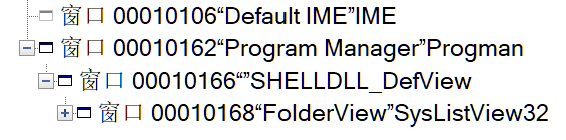
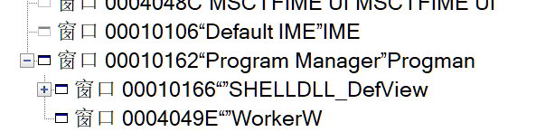
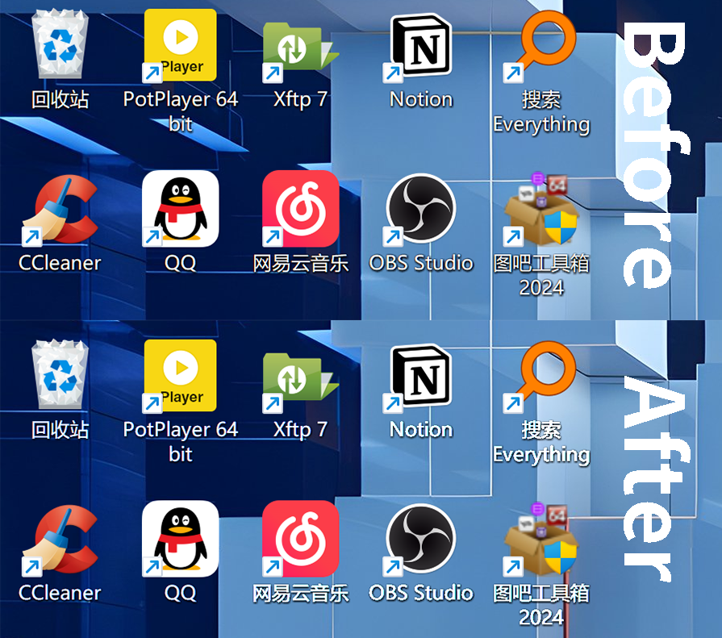

# 前言

在 Windows 8 - Windows 11 23H2 系统中，对 `Program Manager` 发送 `0x052c` 消息（即按下 Win + Tab 或以任意方式触发桌面的切换）后

```c
SendMessageTimeout(hProgman, 0x052c, 0, 0, SMTO_NORMAL, 0x3e8, 0);
```

Windows `Program Manager "Progman"` 会分裂为三个部分 - 两个 `WorkerW` 类窗口和 `Progman` 本身，其中一个 `WorkerW` 窗口是 `SHELLDLL_DefView` 类，即桌面图标的父窗口。此举在于防止切换桌面时导致的闪屏问题。

# Windows11 24H2 的桌面切换

打开 Visual Studio 自带的 Spy++ 工具，查看窗口布局



发送特殊消息后，再次查看窗口布局



`WorkerW` 出现了！只不过 `WorkerW` 出现在了 `Progman` 内部，作为 `Progman` 的子窗口，`SHELLDLL_DefView` 也没有移动位置

返回桌面我们可以发现，桌面图标被锐化了，



如果我们此时将一个视频窗口置于 `WorkerW` 处，我们会发现似乎没有效果... 吗？

将鼠标移到一个桌面图标上，我们发现桌面好像被搂了一个洞

实际上，桌面图标已经透明了，只不过 Windows 在桌面切换时对桌面创建了一个快照覆盖在图标层来，来实现平滑过渡，如果你用四指在触控板上滑动时，你就能看到这个效果。

# 动态壁纸的实现

实现动态壁纸的关键有两个：

1. 桌面图标层透明
2. 能够将视频窗口置于图标层下方

我们现在已经得到了 `WorkerW` 窗口，并且在桌面图标层下方，我们只需要让桌签图标层透明即可

上文分析我们可以得到，实际上我们的桌面图标已经透明了，只不过有一层类似于图片的像素覆盖了图标层，在鼠标放置在图标上时，图标就会重绘，随后变透明

所以我们需要让图标层完全重绘，我的实现是，调用 `ShowWindow` 函数，先设为 `SW_HIDE` (隐藏)， 再设为 `SW_SHOWNORMAL`（正常） 显示，在这个过程中 `SHELLDLL_DefView` 就会自动重绘

```c
ShowWindow(hDefView, SW_HIDE);
Sleep(0);
ShowWindow(hDefView, SW_SHOWNORMAL);
```

完整代码

```c
// hPlayer 为我的播放器窗口
HWND hShell = FindWindowEx(hProgman, 0, L"SHELLDLL_DefView", 0);
if (hDefView!=NULL) {
	HWND hWorkerW = FindWindowEx(hProgman, 0, L"WorkerW", 0);
	if (hWorkerW != NULL) {
		SetParent(hPlayer, hWorkerW);
		ShowWindow(hDefView, SW_HIDE);
		Sleep(0);
		ShowWindow(hDefView, SW_SHOWNORMAL);
		return TRUE;
	}
	else return FALSE;
}
```

最后我们实现了动态壁纸

# 后记

在 24H2 之前实现动态壁纸时仍需使用原先的方法，不过据我搜索，在 23H2 就已经出现过了这种桌面切换方式（可能是某个需要 ViveTools 启用的功能或是 Canary 频道启用的功能），新的切换方式对于动态桌面的代码做了极大的简化。
