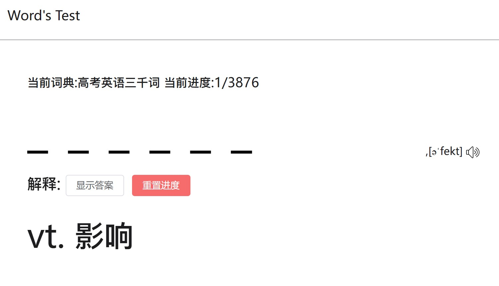
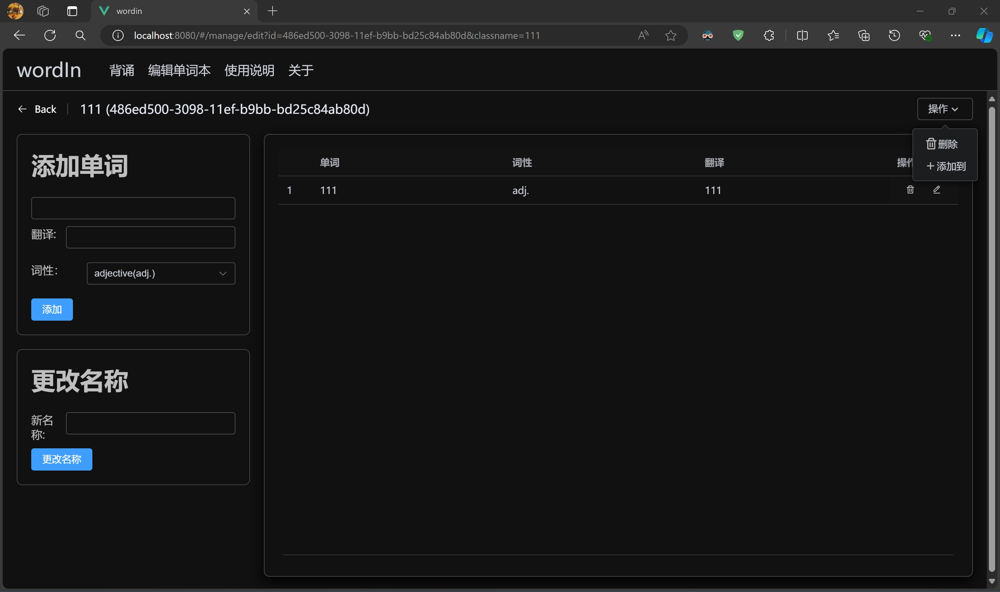

# 聊聊 wordIn

[https://app.cast1e.top/wordin/#/](https://app.cast1e.top/wordin/#/)

## wordIn的诞生

去年8月，我开始了我的大学生活，却发现，我竟然不知道做什么。

高中的时候，我很喜欢写网页，也做过一个项目（后来被重拾了，也就是现在的LyricFinder,下期就说说这个）。于是，我想到要写一个自己的项目。

我问了室友，现在还缺什么，他说，大英的单词很难背，能不能写一个单词默写器。

单词默写器确实是一个很好的主意，于是 wordIn 诞生了 word + in 其实意思是希望这个单词默写器能真正帮助记住单词。

## 还是前端的 wordIn

在写 wordIn 之前，我只写过静态的网页。

wordIn 一开始是一个纯前端的项目，单词由用户添加，保存在localstorage中，同时提供了导入导出的功能

### 开始开发

项目大约从九月末开始开发，一个国庆我就完成了基本的功能，包括单词本的创建管理什么的（现在想想刚开始开发的时候效率是真的高）

因为专注于功能，所以第一版的界面非常简陋。但时，就算界面非常简陋，我还是花了很多时间实现了一个我非常需要的功能：暗黑模式。

我常年使用黑色模式，因为我的眼睛不好……

### 界面

没错，这个就是最初的主页，很丑也没有实用价值，当时是打算临时用的，结果一用就是3个多月。

我非常喜欢用阴影的效果，几乎所有的卡片我都加上了很重的阴影（真的丑）

这个背诵界面也是很远古的继承了，高中的时候我曾经写过这样的一个网页 [Word's test](https://toolbox.cast1e.top/tools/wordtest/index.html)

是不是感觉有点像，其实我是直接从之前的项目把代码复制过来的……，然而，这个界面直到今天都没有变……

这个界面似乎也没变。

## 在线的单词

自己一个一个从课本后面输入单词确实是一件非常麻烦的事情，即使我已经加了很多快捷键帮助单词的输入。但是我的室友还是不仅吐槽换个浏览器都要重新导入导出单词本，所以我做出了一个决定，我要为 wordIn 写一个后端

其实我写后端只花了一天，但是实现的功能也是非常的基础，获取后端存储的单词本，仅此而已，但是这确实一个单词默写器最重要的功能，有了在线的单词本，就可以随时随地背单词，甚至是在手机上，于是在设个时期，我也对手机的网页进行了适配。

您仍可访问到这个版本的 [wordIn](https://toolbox.cast1e.top/tools/wordin/index.html#/)

虽然这个在线单词本已经无法加载了（因为换服务器了）

## 更新的界面

临近寒假，开始赶进度了（

直接很多临时设计的没有意义的界面都被我大刀阔斧砍掉了，同时也优化了很多代码（之前写了一堆效率很低的代码）

### 现在的界面

看似一样，实际上我去掉了所有阴影，用边框来代替了（算不算扁平化？）

然后是一个加了一个 Finder 栏作为网页导航。

好像没变

在单词本少的时候，折叠式的选择页面还是非常高效，但是单词本变多之后就不一样了，所以我重新设计了一个列表式的

变化最大的还是主页，现在主页负责显示历史记录，总算是有点用了，同时历史记录也从一条变成了十条。

## 写在最后

wordIn 是我的第一个完整开发的项目，从前端到后端，也真正是一个有用的项目吧，希望它也能帮助到大家